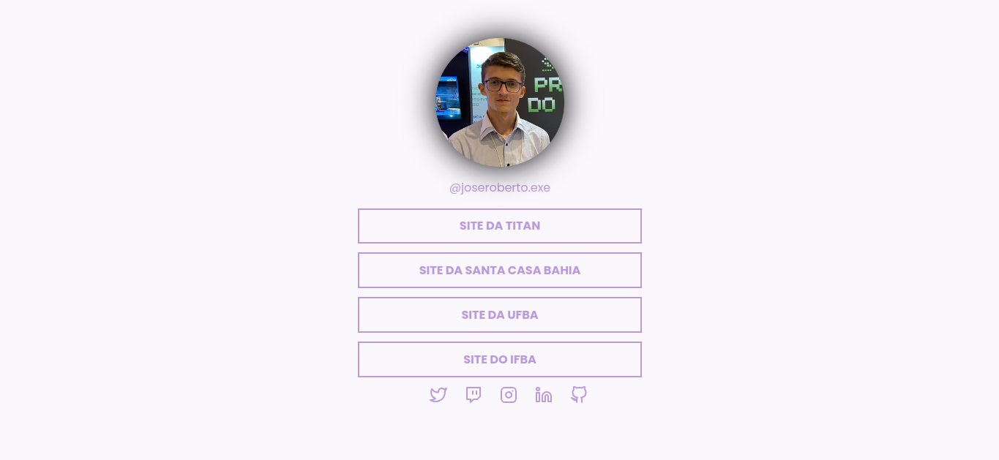
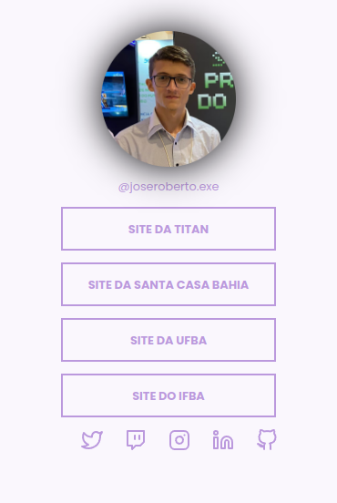
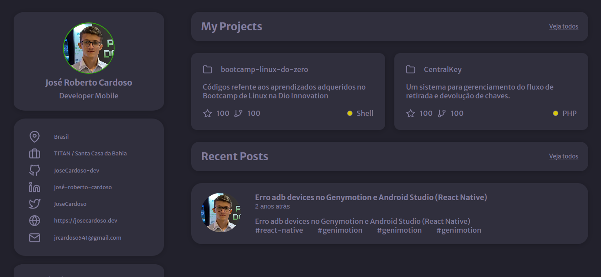
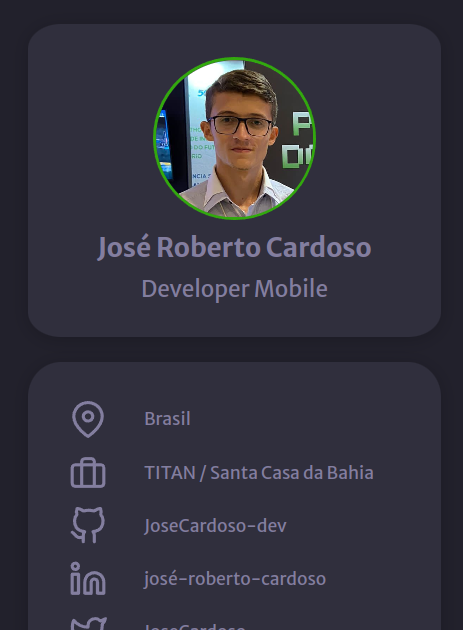
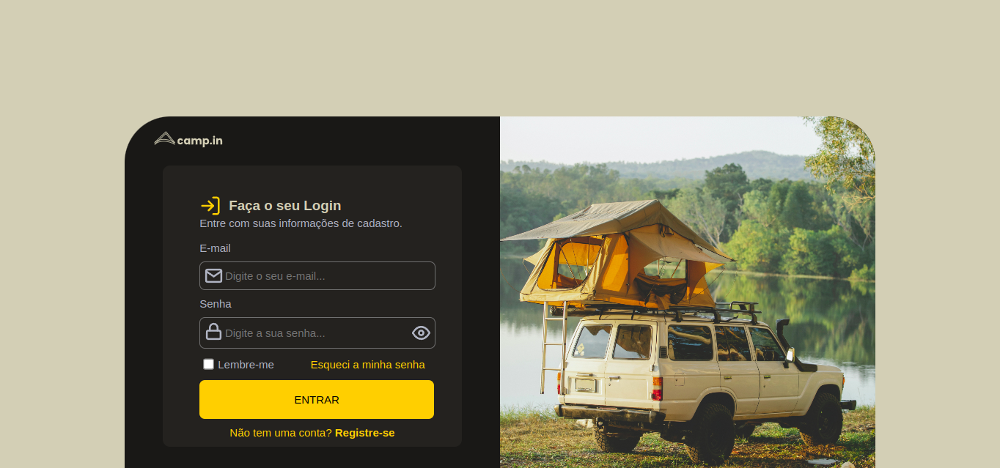

### Olá! Bem vindo! ❤️

Esté diretorio está destinado para hospedar os desafios que foram sobmetido a mim durante a miha trajetoria no programa trainee na TITAN - Empresa jr da UFBA, sendo assim essa trilha de conhecimento nomeada de PTDev-TITAN.

### Desafio: Social Tree

Neste desafio foi criado uma página com uma lista de links que pode ser usada em perfis de redes sociais.

#### Visualização:

##### Modo Desktop

  

##### Modo Mobile

  

***

### Desafio: Portifolio

Neste desafio foi criado uma página para ser um portifolio, contendo varios dados sobre vivencias academicos, proficionais e projetos.

#### Visualização:

##### Modo Desktop

  

##### Modo Mobile

  

### Desafio: Login Form CSS

Neste desafio foi criado uma página para ser uma tela de login, contendo os inputs básicos para login e uma imagem.

#### Visualização:

##### Modo Desktop

  

